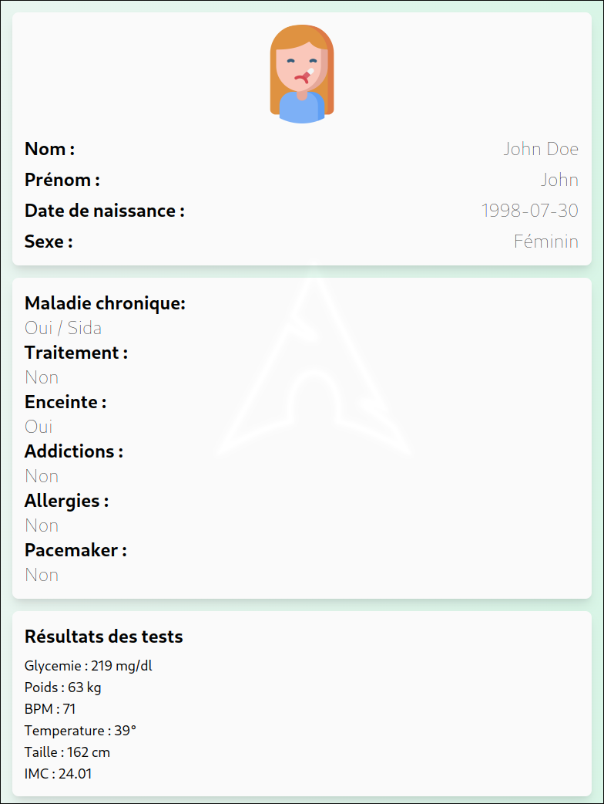

# 🏥 Workshop Project: Front-end Prototype for Medical Examination Terminal

## 🎯 Goal

The goal of this project is to create a front-end prototype for a medical examination terminal that could help combat medical deserts. 💡

## 🔍 Description

This project is a web application that provides a user interface for patients on a medical examination terminal. 
It allows them to :

* Consult their medical informations 💊
* Conduct online medical examinations 💻
* Consult the results of their examinations 📝

## 💻 Technologies used

* HTML 📄
* CSS 💄
* JavaScript 🤖
* OpenAI API 🤖

## 🎉 Features

* User interface for patients 👥
* Consultation of patients' medical informations 💊
* Conduct of online medical examinations 💻
* Consultation of examination results 📊

## 📁 Installation

To install the project, simply clone the Git repository and open the home.html file in a browser. 
You must also add an OpenAI API key to the *apikey* variable in main.js. 🔑

## 👨‍💻 Author

P'tit Lu 😊

## 📝 License

This project is licensed under the MIT License. See the [LICENSE](https://opensource.org/license/mit) file for details. 📝

